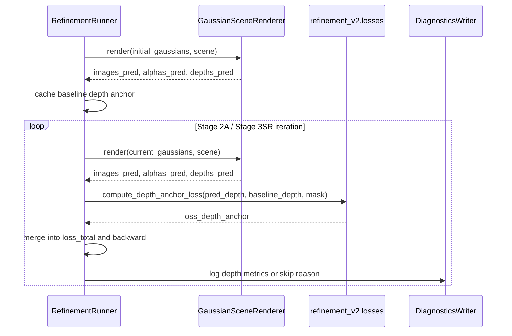

## ADDED Requirements

### Requirement: Baseline depth anchor reference
The system SHALL support constructing an immutable baseline depth anchor for `refinement_v2` from the initial gaussian render output before appearance optimization begins. The reference MUST be captured with the same camera views and intrinsics as the refinement scene, and it MUST preserve both `depths_pred` and any available alpha/visibility signal needed for valid-pixel masking.

#### Scenario: Build baseline reference before Stage 2A
- **WHEN** a refinement run enables depth anchoring and enters the appearance optimization pipeline
- **THEN** the system captures a baseline depth reference from the current input gaussians before the first `Stage 2A` optimization step
- **THEN** the captured reference remains immutable for the rest of the appearance-stage depth anchoring flow

### Requirement: Appearance stages apply normalized depth consistency
The system SHALL compute a depth consistency loss during `Stage 2A` and `Stage 3SR` whenever depth anchoring is enabled and both predicted depth and baseline depth reference are available. The loss MUST use a scale-invariant normalization strategy compatible with the training-time depth supervision semantics, and it MUST only evaluate valid reference pixels.

#### Scenario: Depth loss participates in Stage 2A optimization
- **WHEN** `Stage 2A` runs with depth anchoring enabled and the renderer returns `depths_pred`
- **THEN** the system computes `loss_depth_anchor` from the current predicted depth and the immutable baseline depth reference
- **THEN** the system adds the weighted depth loss to the stage total loss
- **THEN** the system records the depth loss metric in stage diagnostics

### Requirement: V1 anchor scope is limited to appearance stages
The system SHALL limit the V1 depth anchoring behavior to appearance-first stages and MUST NOT require dataset GT depth or external `MoGe/ViPE` depth assets. In V1, `Stage 2B` and later geometry-moving stages MUST continue to run without the new depth anchor requirement unless explicitly extended by a future change.

#### Scenario: Stage 3SR reuses the same baseline reference
- **WHEN** a run proceeds from `Stage 2A` into `Stage 3SR`
- **THEN** the system reuses the same baseline depth anchor captured before `Stage 2A`
- **THEN** the system does not rebuild the anchor from already-updated stage outputs

### Requirement: Missing depth anchor data degrades gracefully
The system SHALL degrade gracefully when depth anchoring is requested but the renderer output or reference construction does not provide usable depth data. In that case, the system MUST skip the depth anchor loss, MUST preserve the existing RGB-based refinement flow, and MUST emit diagnostics that explain why depth anchoring was skipped.

#### Scenario: Renderer depth is unavailable
- **WHEN** depth anchoring is enabled but `depths_pred` is missing or the valid reference mask is empty
- **THEN** the system skips `loss_depth_anchor` for that run or stage
- **THEN** the system continues refinement without crashing
- **THEN** the system records a warning or skip reason in diagnostics output

## Flow Overview

## Sequence Overview

