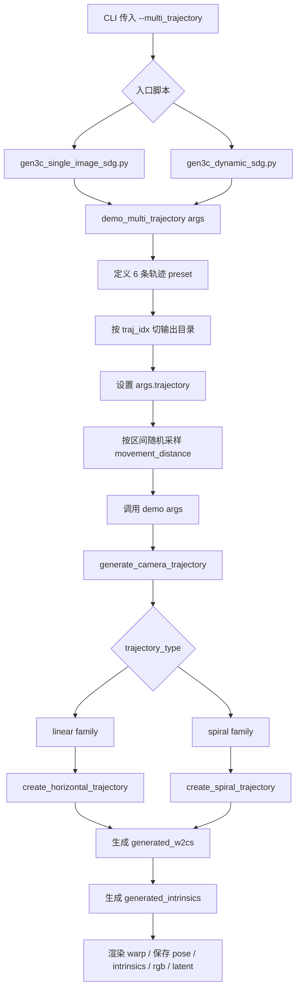
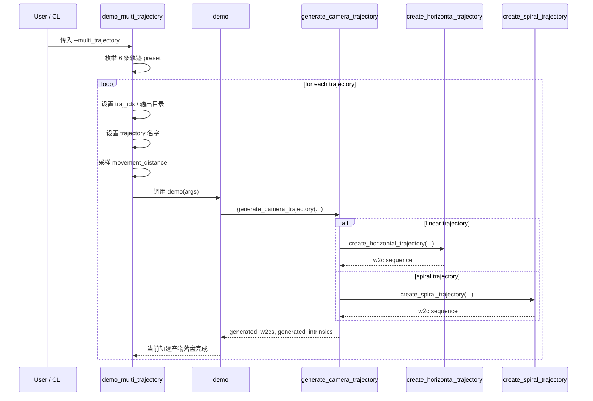

# `multi_trajectory` 相机轨迹流程图

## graph

```mermaid
flowchart TD
    A[CLI 传入 --multi_trajectory] --> B{入口脚本}
    B --> C[gen3c_single_image_sdg.py]
    B --> D[gen3c_dynamic_sdg.py]
    C --> E[demo_multi_trajectory args]
    D --> E
    E --> F[定义 6 条轨迹 preset]
    F --> G[按 traj_idx 切输出目录]
    G --> H[设置 args.trajectory]
    H --> I[按区间随机采样 movement_distance]
    I --> J[调用 demo args]
    J --> K[generate_camera_trajectory]
    K --> L{trajectory_type}
    L --> M[linear family]
    L --> N[spiral family]
    M --> O[create_horizontal_trajectory]
    N --> P[create_spiral_trajectory]
    O --> Q[生成 generated_w2cs]
    P --> Q
    Q --> R[生成 generated_intrinsics]
    R --> S[渲染 warp / 保存 pose / intrinsics / rgb / latent]
```

## sequenceDiagram

```mermaid
sequenceDiagram
    participant User as User / CLI
    participant Entry as demo_multi_trajectory
    participant Main as demo
    participant Traj as generate_camera_trajectory
    participant Linear as create_horizontal_trajectory
    participant Spiral as create_spiral_trajectory

    User->>Entry: 传入 --multi_trajectory
    Entry->>Entry: 枚举 6 条轨迹 preset
    loop for each trajectory
        Entry->>Entry: 设置 traj_idx / 输出目录
        Entry->>Entry: 设置 trajectory 名字
        Entry->>Entry: 采样 movement_distance
        Entry->>Main: 调用 demo(args)
        Main->>Traj: generate_camera_trajectory(...)
        alt linear trajectory
            Traj->>Linear: create_horizontal_trajectory(...)
            Linear-->>Traj: w2c sequence
        else spiral trajectory
            Traj->>Spiral: create_spiral_trajectory(...)
            Spiral-->>Traj: w2c sequence
        end
        Traj-->>Main: generated_w2cs, generated_intrinsics
        Main-->>Entry: 当前轨迹产物落盘完成
    end
```
