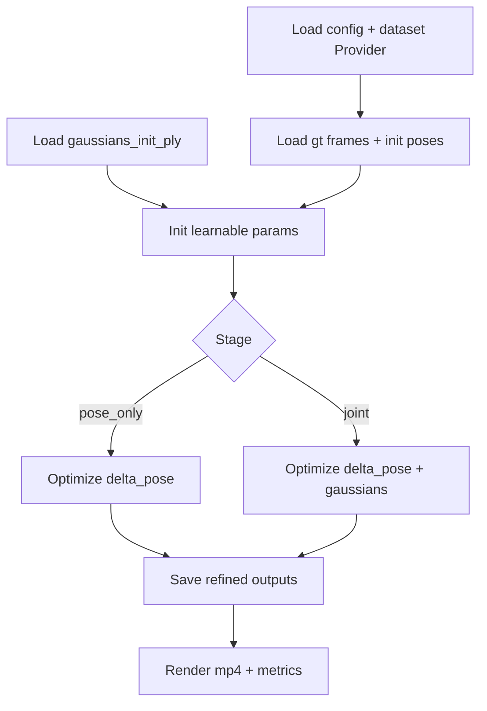
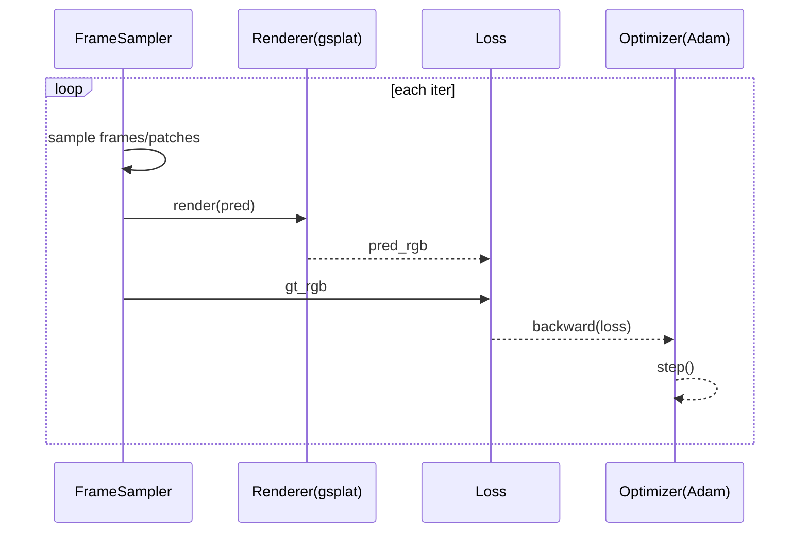

# Spec: 相机+高斯联合优化(refinement),用于降低单轨迹重影

## 背景

Lyra 的推理是 feed-forward:

- 输入: 单轨迹视频(latent 或 RGB) + 相机(intrinsics/pose).
- 输出: 一次前向直接给出 gaussians,并渲染成 `main_gaussians_renderings/rgb_*.mp4`.

当输入视频存在时序不一致,或相机与内容不完全匹配时,常见现象就是:

- "厚表面",像多个轮廓叠在一起.
- 相机运动时拖影明显.

这类问题,只靠推理期轻量旋钮(例如 `gaussian_scale_cap`)有上限.
更强但更贵的办法是:

把 Lyra 输出当初始化,做一次 per-scene 的后处理优化(refinement).

## 目标

1) 明显降低单轨迹输出里的重影/双轮廓.
2) 尽量不破坏"同一轨迹"约束:
   - 如果启用相机优化,只允许小幅 pose delta,并用强正则约束.
3) 输出可复用产物:
   - refined gaussians.
   - 可选 refined poses.
   - 对比渲染视频与指标.

## 不做的事(先明确边界)

- 不改 diffusion 侧产物(视频/latent/pose 的生成逻辑).
- 不引入新的外部 SfM/Colmap 流程.
- 不做大规模 densify/prune 的完整 3DGS 训练复刻(先做短迭代 refinement).

## 数据契约

### 输入

- `gaussians_init_ply`
  - 例如: `outputs/.../gaussians_orig/gaussians_0.ply`
- `demo_config`
  - 例如: `configs/demo/lyra_static.yaml`
  - 用它复用 dataset 的 resize/crop/intrinsics 处理,避免对齐错误.
- `scene_index`
  - demo 通常是 0.

### 输出(建议目录结构)

- `outputs/.../refine/`
  - `gaussians_refined.ply`
  - `poses_refined.npz`(可选)
  - `render_refined.mp4`
  - `metrics.json`
  - `config_effective.yaml`(落盘最终生效参数,便于复现)

## 算法设计

### 总体策略: 分阶段,先对齐再清理

1) `pose_only`:
   - 固定 gaussians.
   - 只优化每帧 pose delta,把对齐做稳.
2) `joint`:
   - 小学习率解冻部分 gaussians(建议先 color/opacity,后几何).
   - 目标是清掉残留重影,同时避免把几何打坏.

### 两条实现路线(根据渲染器可导性选)

#### 路线1: 直接优化 `viewmats`

- 依赖: `gsplat.rasterization` 对 `viewmats` 可导.
- 注意: 文档明确提示 `Ks` 当前不可导,所以 intrinsics 固定.
- 风险: 项目内的 `GaussianRendererDeferred` 使用了自定义 backward,目前会丢弃相机梯度.

#### 路线2(推荐): `viewmats=I`,把 pose 显式作用在高斯上

核心点:

- 让 pose 参数通过 `means_cam_t = w2c_t * means_world` 进入计算图.
- 渲染时使用 `viewmats=I`,避免依赖 viewmat 梯度.
- 同样需要把高斯朝向旋到相机系,否则各向异性会不一致:
  - `quat_cam_t = quat(w2c_t_rot) ⊗ quat_world`.

### 参数化

#### Pose delta(se(3))

- 每帧一个 6D:
  - `delta_rot_t`: axis-angle(3)
  - `delta_trans_t`: translation(3)
- 用 exp map 得到 `T(delta_t)`.
- 推荐组合方式:
  - `w2c_t = T(delta_t) @ w2c_init_t`

#### Gaussian(建议用未激活参数)

- opacity: `sigmoid(opacity_logits)`
- scale: `exp(scale_log)` + `clamp_max(gaussian_scale_cap)`
- quat: `normalize(quat_raw)`
- color: `clip(rgb, 0, 1)`(先不引入 SH)

### Loss 与正则(强烈建议最少集)

#### Photometric

- `L_rgb`: Charbonnier/L1(render_rgb - gt_rgb)
- 可选: 低权重 SSIM

#### 相机约束(保证"同一轨迹")

- `L_pose_l2 = ||delta_t||^2`(贴近原 pose)
- `L_pose_smooth = ||delta_t - delta_{t-1}||^2`(时间平滑)
- Anchor:
  - 固定第 1 帧 `delta_0 = 0`,消除 gauge 自由度

#### 高斯约束(防止雾化/飘点)

- `L_scale`: 对 scale 或 log-scale 做 L2
- `L_opacity`: 轻微惩罚过多半透明点
- 可选: `L_means = ||means - means_init||^2`(仅 joint 阶段,小权重)

### 采样与性能(避免一上来就爆显存)

- 优先只用 `target_index_subsample` 对应的帧集(你当前输出视频的时间点).
- 每步随机采样 1~4 帧,不要每次吃全帧.
- 先用 patch 或 downscale(例如 H/W 降一半),收敛后再切回全分辨率做少量 finetune.

## 流程图

## 时序图(单次迭代)

## 代码落点建议(尽量复用现有模块)

- 数据读取:
  - 复用 `src/models/data/provider.py` 的推理模式,拿到:
    - `cam_view` / `intrinsics` / `target_index` / `images_gt`
- 渲染:
  - 复用 `src/rendering/gs.py` 或 `src/rendering/gs_deferred.py`
- 新增一个最小脚本入口(建议):
  - `scripts/refine_joint.py`
  - 只负责: 载入数据 -> 优化 -> 保存产物

## 任务清单(可直接开工)

- [ ] 任务1: 定义 CLI 与输入输出目录结构(先跑通 I/O)
- [ ] 任务2: 抽取一份 "gt 帧 + pose/intr" 的对齐逻辑(和当前 `rgb_*.mp4` 完全一致)
- [ ] 任务3: 实现 pose delta 的参数化与正则(含 anchor)
- [ ] 任务4: 实现 pose_only 优化闭环(先只优化 delta)
- [ ] 任务5: 实现 joint 阶段(先解冻 color/opacity,再考虑几何)
- [ ] 任务6: 加入 patch/downscale 训练策略(防 OOM,提升收敛速度)
- [ ] 任务7: 输出对比视频与指标(至少 PSNR + sharpness)
- [ ] 任务8: 在 view \"3\" 和你最差的那条轨迹上验证,给出默认超参
