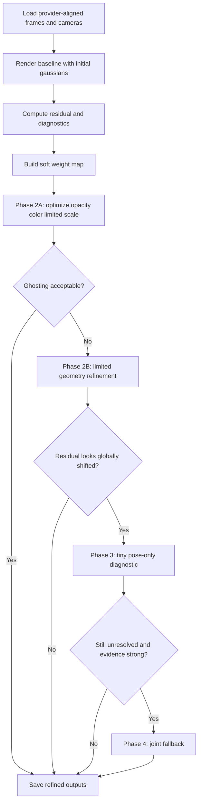
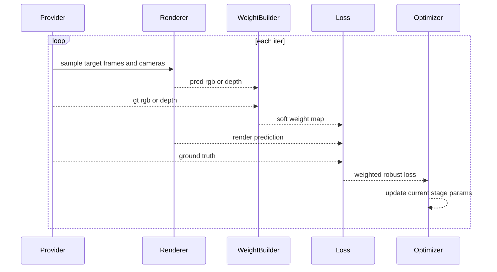

# Spec V2: 鲁棒高斯优先的单轨迹 refinement

## 定位

这份 V2 规格用于替代 V1 的默认推荐顺序.

- V1 的主线更偏向 `pose_only -> joint refinement`.
- V2 改成 `鲁棒监督 -> gaussian-only refinement -> tiny pose-only -> joint fallback`.

旧文件 `specs/joint_refinement_camera_gaussians.md` 保留作为历史讨论记录.
从这一版开始,**默认主线不再把相机联合优化放在最前面**.

## 背景

在当前 Lyra demo 和代码链路下,已经有几件事可以基本确认:

1. 单轨迹下仍然存在明显重影.
2. `view "3"` 明显比 `view "5"` 更稳.
3. `gaussian_scale_cap=0.28` 能明显缓解重影,说明高斯尺度尾部与问题强相关.
4. 当前默认的 deferred renderer 会截断相机梯度.
5. 高斯生成方式是 pixel-aligned,很容易把帧间不一致平均成厚表面.
6. 训练损失里缺少对不稳定监督的 robust masking / residual reweighting.

因此,当前最值得优先优化的不是“让相机也能学起来”,而是:

- 先识别哪些监督不该被强拟合.
- 先控制哪些高斯在制造双轮廓.
- 先把 refinement 做成“外观和透明度优先,几何后置”.

## 核心判断

### 问题本质

当前重影更像下面这类问题:

- diffusion 视频局部细节在不同帧里不完全一致.
- 这些不一致进入 pixel-aligned gaussians 后,被高斯一起吸收.
- 渲染时就表现成厚表面,双轮廓,半透明叠层.

这更接近 `RobustSplat` 里“瞬态干扰污染静态 3D 结构”的方法论问题.
不完全等于“相机 pose 错了”.

### V2 的总原则

1. **监督先鲁棒,再谈优化自由度**
2. **先外观,后几何**
3. **相机只做诊断性介入,不是默认主线**
4. **优先保持原轨迹不变**
5. **尽量复用现有 provider 和 renderer**

## 目标

1. 明显降低单轨迹输出里的厚表面,双轮廓和重影.
2. 保持“同一轨迹”约束.
3. 在不大改主干推理链路的前提下,提供一个可复用的 per-scene refinement 流程.
4. 输出足够多的诊断产物,让后续能判断问题到底来自监督,高斯,还是相机.

## 不做的事

- 不改 diffusion 侧视频 / latent / pose 生成逻辑.
- 不引入完整的传统 3DGS densify-and-clone 训练复刻.
- 不默认启用相机联合优化.
- 不把语义分割系统整体搬进来.

## 直接证据

### 代码层证据

- `src/rendering/gs_deferred.py`
  - `DeferredBP.backward(...)` 对相机相关输入直接返回 `None`.
- `src/models/recon/model_latent_recon.py`
  - 高斯中心由 `rays_o + rays_d * depth` 直接构造.
- `src/models/utils/loss.py`
  - 当前是 `MSE + LPIPS + depth` 为主,没有 residual mask.

### 现象层证据

- 单轨迹也重影,说明不是多轨迹融合才出现的问题.
- `view "3"` 比 `view "5"` 稳,说明运动复杂度会放大问题.
- `gaussian_scale_cap=0.28` 有明显帮助,说明高斯尾部分布值得优先治理.

## V2 的两档方案

### 档位 A: 最佳方案

适合你现在这种“我接受更重的后处理,只要结果更干净”的目标.

- residual-driven soft weight map
- coarse-to-fine weighting
- gaussian-only phase 1
- limited geometry phase 2
- tiny pose-only diagnostic
- joint fallback

### 档位 B: 先能用方案

适合先快速验证方向.

- 只做 RGB residual EMA weight map
- 只做 gaussian-only phase 1
- 不碰 pose
- 不开 joint

如果档位 B 就已经明显缓解重影,就不必进入更重的相机阶段.

## 数据契约

### 输入

- `gaussians_init_ply`
  - 例如 `outputs/.../gaussians_orig/gaussians_0.ply`
- `demo_config`
  - 例如 `configs/demo/lyra_static.yaml`
- `scene_index`
  - demo 通常是 0

### 中间诊断产物

- `residual_maps/*.png`
- `weight_maps/*.png`
- `metrics_stage*.json`
- `diagnostics.json`

### 输出

- `gaussians_refined.ply`
- `render_refined.mp4`
- `metrics.json`
- `config_effective.yaml`
- `poses_refined.npz`
  - 只有开启 pose 诊断或 joint fallback 时才输出

## 算法主线

### Phase 0: 对齐读取与 baseline 诊断

复用现有 provider,直接拿:

- `images_output`
- `cam_view`
- `intrinsics`
- `target_index`

这一阶段不优化任何参数.
只做两件事:

1. 用初始 gaussians 重渲染 target frames
2. 生成 residual 统计和 baseline 指标

### Phase 1: residual-driven soft weighting

这是 V2 的真正起点.

核心思想:

- 不是所有像素都值得同等相信.
- 高残差区域先降权.
- 降权不等于完全忽略,先用 soft weight.

#### V2.0 最小版

- 直接用 RGB residual 构造 `weight_map`
- 用 EMA 或分位数阈值稳定权重
- 前期用低分辨率权重图

#### V2.1 增强版

- 再叠加 perceptual residual
- 可选加入 DINO / VGG / LPIPS 特征差异
- 做 coarse-to-fine 的权重更新

### Phase 2: gaussian-only refinement,先外观后几何

#### Stage 2A: appearance-first

先只优化:

- opacity
- color
- limited scale

先冻结:

- means
- rotation

目标:

- 先去掉雾感和半透明叠层
- 先压掉会制造双轮廓的大尺度高斯

#### Stage 2B: limited geometry

只有在 Stage 2A 不够时才进入.

这一阶段也不建议一上来放开全部几何.
优先级建议:

1. 小幅 scale 微调
2. 小幅 rotation 微调
3. 受限位置更新

位置更新建议尽量受限:

- 优先沿原射线方向做深度式微调
- 或者对 `means - means_init` 加强约束

### Phase 3: tiny pose-only diagnostic

这一阶段不是默认主线.
它只在下面这种证据出现时启用:

- 残差在整张图上呈现一致偏移
- 多个边缘都朝同一方向错开
- 问题不像局部双轮廓,更像整体配准误差

约束必须非常强:

- `delta_0 = 0`
- pose L2
- temporal smoothness
- very small learning rate

如果 Phase 3 没带来明确收益,就直接回退.

### Phase 4: joint fallback

这一步不是默认推荐.
只有在下面 3 个条件同时满足时才启用:

1. Phase 1 + Phase 2 后仍有显著残留重影
2. Phase 3 也不能解释或修复问题
3. 用户接受轨迹被极小幅度修正

如果要做 joint,优先保留 V1 里“把 pose 显式作用到高斯”的技术路线.
但它在 V2 里只是 fallback,不是主线.

## 阶段门控与回退规则

这一节的目的只有一个:

- 让后面真正实现时,不需要每跑一次就重新猜“该不该进下一阶段”

### Phase 0 -> Phase 1

进入条件:

- baseline 渲染已经成功
- 已输出每帧 residual 统计
- 已拿到至少一组 baseline 指标:
  - `psnr`
  - `lpips` 或替代 perceptual 指标
  - `sharpness`
  - `scale_tail_ratio`
  - `opacity_lowconf_ratio`

如果连 baseline 都没有稳定产出,不要往后走.
先修 provider 对齐或渲染读写问题.

### Phase 1 -> Stage 2A

进入条件:

- 至少一轮 `weight_map` 构造成功
- `weight_map` 没有退化成全 0 或几乎全 1
- 高残差区域与肉眼看到的 ghosting 区域大体一致

停止条件:

- `weight_map` 连续若干次更新后基本稳定
- 低信任区域不再大幅抖动

回退条件:

- 权重图把大部分前景都错误打成低权
- 结果出现整体发灰 / 过平 / 结构被抹掉

此时应回退到更保守的 V2.0:

- 只用 RGB residual
- 提高 `weight_floor`
- 关掉 perceptual 分支

### Stage 2A -> Stage 2B

只有下面至少 2 条成立时才进 Stage 2B:

1. `scale_tail_ratio` 已下降,但双轮廓仍明显
2. `opacity_lowconf_ratio` 已下降,但局部结构仍重叠
3. `psnr` 没有明显崩塌
4. 肉眼看起来是“位置重叠”,不只是“透明雾感”

如果 Stage 2A 已经把问题压到可接受,就直接结束.
不要为了“也许还能更好”而过早放开几何.

### Stage 2B -> Phase 3

只有在 residual 图呈现明显“整图同向偏移”时才考虑 Phase 3.

典型信号:

- 多个物体边缘朝同一方向错开
- 不同区域的偏移方向一致
- 问题像“整体错位”,而不是“局部重影堆叠”

如果只是局部双轮廓,不要进 Phase 3.

### Phase 3 -> Phase 4

只有下面全部满足才允许进 joint fallback:

1. Stage 2A / 2B 收益已见顶
2. tiny pose-only 的收益有限但方向正确
3. 用户接受轨迹发生极小幅度修正
4. 诊断上同时存在:
   - 局部结构重叠
   - 全局一致偏移

否则就停在更稳的阶段.

## `weight_map` 构造细节

这一节是 V2 的核心实现说明.

### 基础定义

对每个像素先算一个残差强度:

- `r_rgb = mean_c(abs(pred_rgb - gt_rgb))`
- 可选 `r_perc = perceptual_distance(pred_rgb, gt_rgb)`

合成残差:

- `r = alpha_rgb * r_rgb + alpha_perc * r_perc`

默认建议:

- V2.0: `alpha_rgb = 1.0`, `alpha_perc = 0.0`
- V2.1: `alpha_rgb = 0.7`, `alpha_perc = 0.3`

### 归一化

不要直接对原始残差做指数映射.
更稳的做法是先按分位数归一化:

- `q_low = quantile(r, 0.50)`
- `q_high = quantile(r, 0.90)` 或 `0.95`
- `r_norm = clip((r - q_low) / (q_high - q_low + eps), 0, 1)`

这样更不容易被极端高残差点带偏.

### 变成 soft trust weight

建议把 “大残差 = 小权重” 写成平滑映射:

- `w_raw = exp(-r_norm / tau)`

推荐:

- `tau = 0.35 ~ 0.60`

为了避免直接把某块完全抛弃,增加下界:

- `w = clamp(w_raw, weight_floor, 1.0)`

推荐:

- `weight_floor = 0.15 ~ 0.30`

### 时间稳定

如果逐迭代更新 `weight_map`,建议加入 EMA:

- `w_t = ema_decay * w_{t-1} + (1 - ema_decay) * w_new`

推荐:

- `ema_decay = 0.8 ~ 0.95`

这样可以避免某一轮的噪声把监督突然掀翻.

### 空间稳定

为了防止 `weight_map` 全是椒盐噪声,建议至少做一种平滑:

1. 小核 Gaussian blur
2. 小尺寸 average pooling 后再上采样
3. coarse-to-fine 多尺度更新

默认优先:

- 前期用低分辨率 `weight_map`
- 后期再提高到原分辨率

### 不该做的事

- 不要把高残差区域直接二值砍掉
- 不要一开始就把 `weight_floor` 压得太低
- 不要在 `weight_map` 还不稳定时开放几何

## 参数分组与可训练变量

### Stage 2A: 允许更新

- `opacity`
- `color / feature / sh`
- `scale`

### Stage 2A: 默认冻结

- `means`
- `rotation`
- `camera pose`

### Stage 2B: 有条件放开

- `rotation`
- `means_along_ray` 或受限 `means`

比起直接放开 3D 自由位置,更推荐先做:

- 沿原射线方向的小幅深度更新

原因很简单:

- 这更贴合 Lyra 当前 pixel-aligned gaussians 的生成方式
- 也更不容易把局部噪声放大成整体漂移

### Phase 3: 只允许更新

- `pose_delta`

其余保持冻结.

### Phase 4: joint fallback

建议分两组学习率:

- `lr_pose << lr_gaussian_appearance`
- `lr_means` 也应明显小于 `lr_opacity / lr_color`

避免一进 joint 就把轨迹和场景一起带飞.

## Loss 设计

### Photometric

- `L_rgb_weighted = weight_map * Charbonnier(render_rgb - gt_rgb)`
- 可选低权重 `SSIM`

### Gaussian regularization

- `L_scale_tail`
  - 专门惩罚大尺度尾部
- `L_opacity_sparse`
  - 轻微压低过多半透明点
- `L_means_anchor`
  - 仅在 Stage 2B 启用

### Pose regularization

- `L_pose_l2`
- `L_pose_smooth`
- anchor frame

## 默认超参数建议

这一节给的是 **第一版可跑默认值**.
不是理论最优值.
目标是先稳,再慢慢放开.

| 模块 | 参数 | 默认值 | 建议范围 | 说明 |
| --- | --- | --- | --- | --- |
| Weight map | `alpha_rgb` | `1.0` | `0.6 ~ 1.0` | V2.0 建议只开 RGB |
| Weight map | `alpha_perc` | `0.0` | `0.0 ~ 0.4` | 先关,稳定后再开 |
| Weight map | `q_low` | `0.50` | `0.40 ~ 0.60` | 归一化低分位 |
| Weight map | `q_high` | `0.90` | `0.85 ~ 0.97` | 归一化高分位 |
| Weight map | `tau` | `0.45` | `0.35 ~ 0.60` | 控制权重衰减斜率 |
| Weight map | `weight_floor` | `0.20` | `0.15 ~ 0.30` | 避免硬屏蔽 |
| Weight map | `ema_decay` | `0.90` | `0.80 ~ 0.95` | 时序稳定 |
| Stage 2A | `iters_stage2a` | `300 ~ 800` | `200 ~ 1200` | 先短跑 |
| Stage 2A | `lr_opacity` | `1e-2` | `3e-3 ~ 2e-2` | 雾感优先处理 |
| Stage 2A | `lr_color` | `5e-3` | `1e-3 ~ 1e-2` | 避免颜色乱跳 |
| Stage 2A | `lr_scale` | `1e-3` | `3e-4 ~ 3e-3` | 只做受限缩放 |
| Stage 2B | `iters_stage2b` | `200 ~ 500` | `100 ~ 800` | 只在必要时开 |
| Stage 2B | `lr_means` | `1e-4` | `3e-5 ~ 5e-4` | 明显低于外观参数 |
| Stage 2B | `means_delta_cap` | `0.01 ~ 0.03` scene scale | - | 防止位置跑飞 |
| Phase 3 | `iters_pose` | `50 ~ 150` | `30 ~ 200` | 只做 tiny diagnostic |
| Phase 3 | `lr_pose` | `1e-5 ~ 5e-5` | `1e-6 ~ 1e-4` | 一定要小 |
| Phase 4 | `iters_joint` | `100 ~ 300` | `50 ~ 500` | 最后兜底 |

## 诊断产物与 JSON 结构

如果规格不把诊断结构写清楚,后面实现时最容易越写越散.
这里先把最小 contract 固定住.

### `diagnostics.json`

建议至少包含:

```json
{
  "scene_id": 0,
  "view_id": "3",
  "phase_reached": "stage2a",
  "stopped_reason": "ghosting_acceptable",
  "used_pose_refinement": false,
  "used_joint_fallback": false,
  "baseline": {
    "psnr": 0.0,
    "lpips": 0.0,
    "sharpness": 0.0,
    "scale_tail_ratio": 0.0,
    "opacity_lowconf_ratio": 0.0
  },
  "final": {
    "psnr": 0.0,
    "lpips": 0.0,
    "sharpness": 0.0,
    "scale_tail_ratio": 0.0,
    "opacity_lowconf_ratio": 0.0
  },
  "deltas": {
    "psnr_gain": 0.0,
    "lpips_drop": 0.0,
    "sharpness_gain": 0.0,
    "scale_tail_drop": 0.0
  }
}
```

### `metrics_stage*.json`

每个阶段建议单独存:

- `phase_name`
- `iter`
- `loss_total`
- `loss_rgb_weighted`
- `loss_scale_tail`
- `loss_opacity_sparse`
- `loss_pose_l2`
- `loss_pose_smooth`
- `psnr`
- `lpips`
- `sharpness`

### 可视化文件

至少输出:

- `residual_maps/residual_rgb_mean_*.png`
- `weight_maps/weight_map_*.png`
- `renders_before_after/frame_xxx_before_after.png`
- `histograms/scale_hist_before_after.png`

如果开启 Phase 3 或 Phase 4,再额外输出:

- `pose/pose_delta_norm_curve.png`
- `pose/pose_delta_summary.json`

## 失败模式与回退手册

### 现象1: 画面整体变灰,细节一起掉

高概率原因:

- `weight_floor` 太低
- perceptual 分支过强
- `weight_map` 把大面积有效前景也降权了

优先修法:

1. 先回退到纯 RGB residual
2. 提高 `weight_floor`
3. 降低 `alpha_perc`

### 现象2: 双轮廓少了,但表面开始抖

高概率原因:

- Stage 2B 太早放开几何
- `lr_means` 太高
- `means_delta_cap` 太宽

优先修法:

1. 回退到 Stage 2A
2. 只保留 scale / opacity 更新
3. 把位置更新改成 strictly along-ray

### 现象3: 局部更干净了,但整图错位变明显

高概率原因:

- 问题里原本就夹杂了全局 pose 偏差
- gaussian-only 已经到了上限

优先修法:

1. 进入 tiny pose-only diagnostic
2. 先验证 pose delta 是否小而稳定
3. 只有证据强时才进 joint fallback

### 现象4: 训练 loss 下降,但肉眼几乎没变

高概率原因:

- loss 被大面积平滑区域主导
- 指标没有对准 ghosting 的主观问题

优先修法:

1. 增加边缘区 residual 统计
2. 单独记录厚表面区域的局部指标
3. 保留 before/after 裁剪图,不要只看全帧平均指标

## 工程拆分建议

为了避免后面一上来写成一个巨大的脚本,建议拆成下面几个最小模块:

### `scripts/refine_robust_v2.py`

只负责:

- CLI
- 读取配置
- 串起阶段控制器
- 保存最终产物

### `src/refinement_v2/stage_controller.py`

负责:

- 阶段切换
- 入口/退出判断
- 回退规则

### `src/refinement_v2/weight_builder.py`

负责:

- residual 统计
- `weight_map` 构造
- EMA / blur / coarse-to-fine

### `src/refinement_v2/gaussian_adapter.py`

负责:

- 把 `.ply` 高斯读成可训练参数
- 按阶段冻结 / 解冻参数组
- 施加 `means_delta_cap`

### `src/refinement_v2/diagnostics.py`

负责:

- 指标汇总
- JSON 输出
- 可视化落盘

## CLI 设计草案

这一节的目标是把 `scripts/refine_robust_v2.py` 的外部接口先固定住.
这样后续实现时,脚本参数就不会边写边漂.

### 基本调用

```bash
python3 scripts/refine_robust_v2.py \
  --config configs/demo/lyra_static.yaml \
  --gaussians outputs/.../gaussians_orig/gaussians_0.ply \
  --scene-index 0 \
  --view-id 3 \
  --outdir outputs/refine_v2/demo_view3
```

### 建议参数

#### 输入类

- `--config`
  - provider / dataset 对齐所需主配置
- `--gaussians`
  - 初始高斯 `.ply`
- `--scene-index`
  - 默认 `0`
- `--view-id`
  - 指定验证或细化的主轨迹
- `--frame-indices`
  - 可选,显式指定参与优化的帧
- `--target-subsample`
  - 若不传 `frame-indices`,则按步长子采样

#### 阶段控制类

- `--enable-stage2b`
  - 是否允许 limited geometry
- `--enable-pose-diagnostic`
  - 是否允许 tiny pose-only
- `--enable-joint-fallback`
  - 是否允许 joint fallback
- `--stop-after`
  - 可选值:
    - `phase0`
    - `phase1`
    - `stage2a`
    - `stage2b`
    - `phase3`
    - `phase4`

#### 超参数覆盖类

- `--weight-floor`
- `--weight-tau`
- `--ema-decay`
- `--iters-stage2a`
- `--iters-stage2b`
- `--iters-pose`
- `--iters-joint`
- `--lr-opacity`
- `--lr-color`
- `--lr-scale`
- `--lr-means`
- `--lr-pose`

#### 运行策略类

- `--device`
  - 默认 `cuda`
- `--mixed-precision`
  - 默认关闭,先保守
- `--resume`
  - 从上次中断状态恢复
- `--save-every`
  - 每隔多少 iter 落一次状态
- `--dry-run`
  - 只跑 Phase 0 与配置检查
- `--overwrite`
  - 已有输出目录时是否覆盖

### 推荐的最小使用姿势

第一版实现时,建议只公开下面这一小撮“够用参数”:

- `--config`
- `--gaussians`
- `--scene-index`
- `--view-id`
- `--outdir`
- `--enable-stage2b`
- `--enable-pose-diagnostic`
- `--enable-joint-fallback`
- `--resume`
- `--dry-run`

其他高级参数可以先从配置文件或内部默认值走.
不要第一版就把 CLI 堆成一个巨型面板.

## 输出目录布局

为了让诊断和断点续跑清晰,建议从一开始就固定目录结构:

```text
outdir/
  config_effective.yaml
  diagnostics.json
  metrics.json
  state/
    latest.pt
    stage2a_last.pt
    stage2b_last.pt
    phase3_last.pt
  residual_maps/
  weight_maps/
  renders_before_after/
  histograms/
  pose/
  gaussians/
    gaussians_init_copy.ply
    gaussians_stage2a.ply
    gaussians_stage2b.ply
    gaussians_refined.ply
  videos/
    render_before.mp4
    render_after.mp4
```

### 为什么要有 `state/`

因为 V2 天然就是分阶段流程.
如果中途炸掉,或者你只想停在 `Stage 2A`,就应该能直接恢复.

第一版即便不做完整 optimizer state 恢复,也至少应保存:

- 当前阶段名
- 当前 iter
- 当前高斯参数
- 当前 `weight_map` 状态
- 当前最优指标摘要

## 配置对象草案

下面这些对象不一定要一字不差照抄.
但建议实现时保持这个层次.

### `RefinementRunConfig`

```python
from dataclasses import dataclass
from pathlib import Path

@dataclass
class RefinementRunConfig:
    config_path: Path
    gaussians_path: Path
    outdir: Path
    scene_index: int = 0
    view_id: str | None = None
    target_subsample: int = 4
    enable_stage2b: bool = True
    enable_pose_diagnostic: bool = False
    enable_joint_fallback: bool = False
    stop_after: str | None = None
    resume: bool = False
    dry_run: bool = False
```

### `StageHyperParams`

```python
@dataclass
class StageHyperParams:
    weight_floor: float = 0.20
    weight_tau: float = 0.45
    ema_decay: float = 0.90
    iters_stage2a: int = 600
    iters_stage2b: int = 300
    iters_pose: int = 100
    iters_joint: int = 200
    lr_opacity: float = 1e-2
    lr_color: float = 5e-3
    lr_scale: float = 1e-3
    lr_means: float = 1e-4
    lr_pose: float = 3e-5
```

### `SceneBundle`

```python
@dataclass
class SceneBundle:
    gt_images: torch.Tensor
    cam_view: torch.Tensor
    intrinsics: torch.Tensor
    frame_indices: list[int]
    scene_index: int
    view_id: str | None
```

## 模块接口签名草案

### `stage_controller.py`

```python
class StageController:
    def choose_next_stage(self, diagnostics: dict) -> str: ...
    def should_stop_stage(self, stage_name: str, metrics_history: list[dict]) -> bool: ...
    def should_fallback(self, diagnostics: dict) -> bool: ...
    def summarize_stop_reason(self, diagnostics: dict) -> str: ...
```

职责:

- 不参与具体优化
- 只负责判断“接下来去哪”

### `weight_builder.py`

```python
class WeightBuilder:
    def build_residual_map(self, pred_rgb: torch.Tensor, gt_rgb: torch.Tensor) -> torch.Tensor: ...
    def build_weight_map(self, residual_map: torch.Tensor, prev_weight_map: torch.Tensor | None = None) -> torch.Tensor: ...
    def summarize_weight_stats(self, weight_map: torch.Tensor) -> dict: ...
```

职责:

- 把 residual 变成稳定的 soft trust map
- 不直接关心高斯参数长什么样

### `gaussian_adapter.py`

```python
class GaussianAdapter:
    def load_from_ply(self, path: Path) -> None: ...
    def freeze_for_stage(self, stage_name: str) -> None: ...
    def build_optimizer(self, stage_name: str, hparams: StageHyperParams) -> torch.optim.Optimizer: ...
    def export_ply(self, path: Path) -> None: ...
    def summarize_gaussian_stats(self) -> dict: ...
```

职责:

- 屏蔽 `.ply` <-> 可训练参数之间的转换细节
- 提供统一的冻结 / 解冻策略

### `diagnostics.py`

```python
class DiagnosticsWriter:
    def log_stage_metrics(self, stage_name: str, metrics: dict) -> None: ...
    def save_weight_map(self, stage_name: str, frame_id: int, weight_map: torch.Tensor) -> None: ...
    def save_residual_map(self, stage_name: str, frame_id: int, residual_map: torch.Tensor) -> None: ...
    def finalize(self, summary: dict) -> None: ...
```

职责:

- 统一所有落盘行为
- 避免脚本里到处散着 `save_json` 和 `save_png`

## 执行状态机建议

这部分不是为了炫技.
而是为了避免后面脚本逻辑写成一堆 if/else.

### 推荐状态

- `init`
- `phase0_ready`
- `phase1_ready`
- `stage2a_running`
- `stage2a_done`
- `stage2b_running`
- `stage2b_done`
- `phase3_running`
- `phase3_done`
- `phase4_running`
- `done`
- `failed`

### 推荐转移原则

- 所有阶段结束都必须带 `stop_reason`
- 所有失败都必须写入 `state/latest.pt` 和 `diagnostics.json`
- 如果 `resume=true`,优先从最近一个 `*_last.pt` 恢复

### `stop_reason` 建议枚举

- `ghosting_acceptable`
- `metrics_plateau`
- `weight_map_unstable`
- `geometry_overfit_risk`
- `pose_gain_too_small`
- `joint_not_allowed`
- `runtime_error`

## 实现顺序建议

为了尽量减少第一次开工就陷入复杂度泥潭,建议按这个顺序来:

### 第一步

- 只实现 `Phase 0 + Phase 1 + Stage 2A`
- 不做 pose
- 不做 joint
- 不做 resume

目标:

- 先证明“residual weighting + appearance-first”确实能改善观感

### 第二步

- 加 `Stage 2B`
- 只开放受限几何
- 增加 `means_delta_cap`

目标:

- 验证是否真的需要 geometry

### 第三步

- 加 `Phase 3 tiny pose-only`
- 加最小状态保存

目标:

- 把“是不是 pose 问题”从猜测变成证据

### 第四步

- 最后才加 `joint fallback`
- 同时补完 `resume`

目标:

- 保证重路径只在确有必要时存在

## 文件级实现蓝图

这一节把实现进一步压到 file-by-file 的粒度.
目标不是强行新增很多文件.
目标是避免把所有逻辑塞进 `scripts/refine_robust_v2.py`.

### `scripts/refine_robust_v2.py`

第一版只做 orchestration:

1. 解析 CLI
2. 加载配置对象
3. 构建 `SceneBundle`
4. 创建 `GaussianAdapter`
5. 创建 `StageController`
6. 按阶段驱动优化
7. 调 `DiagnosticsWriter` 落盘

**不要**在这个脚本里直接写:

- `weight_map` 公式
- 参数冻结逻辑
- 阶段判断规则
- 大量 json/png 保存细节

### `src/refinement_v2/config.py`

建议放:

- `RefinementRunConfig`
- `StageHyperParams`
- `load_effective_config(...)`
- CLI 参数到 dataclass 的转换

这样能把“配置解析”和“算法逻辑”切开.

### `src/refinement_v2/data_loader.py`

建议放:

- `build_scene_bundle(...)`
- 帧索引筛选
- `view_id` 与 `target_subsample` 解析
- provider 输出向 `SceneBundle` 的标准化

目的:

- 把 provider 细节隔离掉
- 后面如果换数据源,不用动 stage logic

### `src/refinement_v2/runner.py`

建议放:

- `run_refinement(...)`
- 串起 `Phase 0 -> Phase 1 -> Stage 2A -> ...`
- 管理阶段内循环

这个文件应该是“算法主控”.
但不直接持有落盘细节.

### `src/refinement_v2/stage_controller.py`

建议放:

- 阶段选择逻辑
- plateau 判断
- stop_reason 生成
- fallback 判定

这个文件只回答:

- “要不要进下一阶段?”
- “为什么停?”

### `src/refinement_v2/weight_builder.py`

建议放:

- residual 计算
- quantile normalize
- `weight_map` 构造
- EMA / blur / coarse-to-fine

如果后面要试:

- feature residual
- LPIPS residual

也优先加在这里.

### `src/refinement_v2/gaussian_adapter.py`

建议放:

- 读写 `.ply`
- 参数 tensor 化
- 按 stage 冻结 / 解冻
- optimizer 构建
- 高斯统计摘要

这个文件是整个实现里最关键的“边界层”.
因为它把现有 Lyra 高斯表示和新 refinement 逻辑接起来了.

### `src/refinement_v2/losses.py`

建议放:

- `compute_weighted_rgb_loss(...)`
- `compute_scale_tail_loss(...)`
- `compute_opacity_sparse_loss(...)`
- `compute_pose_regularization(...)`

不要让 loss 公式散落在 runner 里.

### `src/refinement_v2/diagnostics.py`

建议放:

- metrics 聚合
- json 序列化
- png / mp4 可视化输出
- before/after 对比图

### `src/refinement_v2/state_io.py`

如果第一版就做 `resume`,建议单独拆出:

- `save_state(...)`
- `load_latest_state(...)`
- `save_best_snapshot(...)`

这样能避免 runner 里混进大量 checkpoint I/O 逻辑.

## 主流程伪代码

下面这个伪代码不是最终代码.
但它应该接近真正实现时的控制流.

```python
def main():
    run_cfg, hparams = load_effective_config_from_cli()
    scene = build_scene_bundle(run_cfg)
    gaussians = GaussianAdapter.from_ply(run_cfg.gaussians_path)
    diagnostics = DiagnosticsWriter(run_cfg.outdir)
    controller = StageController(run_cfg, hparams)
    runner = RefinementRunner(scene, gaussians, diagnostics, controller, hparams)

    if run_cfg.dry_run:
        runner.run_phase0_only()
        return

    if run_cfg.resume:
        runner.restore_latest_state()

    runner.run()
```

```python
class RefinementRunner:
    def run(self):
        self.run_phase0()
        self.run_phase1_prepare_weights()
        self.run_stage2a()

        if self.controller.should_enter_stage2b(self.diagnostics_state):
            self.run_stage2b()

        if self.controller.should_enter_pose_diagnostic(self.diagnostics_state):
            self.run_phase3_pose_only()

        if self.controller.should_enter_joint_fallback(self.diagnostics_state):
            self.run_phase4_joint()

        self.export_final_outputs()
```

### 阶段内循环伪代码

```python
def run_stage2a(self):
    self.gaussians.freeze_for_stage(\"stage2a\")
    optimizer = self.gaussians.build_optimizer(\"stage2a\", self.hparams)

    for iter_idx in range(self.hparams.iters_stage2a):
        pred = self.render_current_scene()
        residual = self.weight_builder.build_residual_map(pred.rgb, self.scene.gt_images)
        weight = self.weight_builder.build_weight_map(residual, self.prev_weight_map)
        losses = compute_stage2a_losses(pred, self.scene, self.gaussians, weight)
        losses.total.backward()
        optimizer.step()
        optimizer.zero_grad(set_to_none=True)
        self.prev_weight_map = weight
        self.diagnostics.log_stage_metrics(\"stage2a\", summarize(losses, pred, weight))

        if self.controller.should_stop_stage(\"stage2a\", self.diagnostics.history):
            break
```

## 最小测试矩阵

即使还没正式写测试代码,规格里也应该先把测试矩阵定住.

### 单元级

#### `weight_builder`

- 输入全 0 residual,输出应接近全 1 权重
- 输入极端高 residual 区域,输出应显著降权,但不低于 `weight_floor`
- 开启 EMA 后,第二次输出不应突变

#### `stage_controller`

- 当 diagnostics 显示 `ghosting_acceptable`,应停止在当前阶段
- 当 diagnostics 显示 `global_shift_detected`,才允许进入 Phase 3
- 未显式开启 `joint_fallback` 时,不能进入 Phase 4

#### `gaussian_adapter`

- `freeze_for_stage(\"stage2a\")` 后,`means` 和 `rotation` 不应参与优化
- 导出 `.ply` 后字段数与输入兼容

### 集成级

#### `dry_run`

- 应能跑通 `Phase 0`
- 输出 baseline 指标和最小诊断文件

#### `stage2a_only`

- 在 `view 3` 上不应明显修坏结果
- 在最差轨迹上应至少带来某一项局部改善

#### `resume`

- 中断后恢复,应能从最近阶段继续
- 恢复后输出目录不应被重置

## 实现陷阱清单

### 陷阱1: 把 provider 输出 shape 假定死

风险:

- 后面不同配置下 `B / V / T / H / W` 维度约定可能不一样

规避:

- 在 `data_loader.py` 做统一标准化
- 不要在 runner 到处手写 `permute/view`

### 陷阱2: 把高斯参数冻结逻辑写散

风险:

- 一个 stage 看起来冻结了,实际上 optimizer 里还挂着旧参数组

规避:

- 冻结 / 解冻只通过 `GaussianAdapter` 做
- 每次进入新阶段重新构建 optimizer

### 陷阱3: 诊断输出和算法状态耦合

风险:

- 一旦保存 png/json 失败,整个优化流程一起崩

规避:

- `DiagnosticsWriter` 尽量与训练主循环解耦
- 关键状态优先保存,可视化失败最多降级告警

### 陷阱4: 一开始就做完整 resume

风险:

- 复杂度暴涨
- 很多时间花在 optimizer state / 兼容性问题上

规避:

- 第一版只恢复阶段、高斯参数和关键指标
- optimizer state 恢复放到第二版

## 验证协议

真正落地时,默认至少做两组验证:

### 验证组 A: 当前默认最稳轨迹

- `view "3"`
- 目标: 确认 V2 不会把“已经相对稳”的结果修坏

### 验证组 B: 当前最差轨迹

- `view "5"` 或用户指出的最差轨迹
- 目标: 确认 V2 对最明显 ghosting 样例有真实收益

### 验证通过线

建议至少满足:

1. 最差轨迹主观更干净
2. 最稳轨迹没有明显被修坏
3. `sharpness` 不降或小升
4. `psnr` 不明显崩塌
5. `scale_tail_ratio` 下降

如果只对最差轨迹有效,但把最稳轨迹修坏,默认参数就不能直接推广.

## 决策规则

| 观察到的残差模式 | 优先动作 | 不建议先做什么 |
| --- | --- | --- |
| 局部双轮廓,局部厚表面 | Phase 1 + Stage 2A | 先动 pose |
| 大面积雾感,边界发虚 | Stage 2A,加强 scale/opacity 约束 | 直接 joint |
| 局部仍有结构重叠 | Stage 2B | 直接放开全部 geometry |
| 整图一致错位 | Phase 3 | 直接 joint |
| 前面都无效,且证据显示既有局部重影又有全局配准误差 | Phase 4 | 跳过诊断直接上重优化 |

## 推荐流程图



## 单次迭代时序



## 代码落点建议

### 尽量复用

- 数据读取:
  - `src/models/data/provider.py`
- 渲染:
  - 优先先复用 `src/rendering/gs.py` 或 `src/rendering/gs_deferred.py`
- 初始高斯来源:
  - `sample.py` 导出的 `gaussians_orig/gaussians_0.ply`

### 建议新增的最小入口

- `scripts/refine_robust_v2.py`

它只负责:

1. 载入 scene 对齐数据
2. 载入初始 gaussians
3. 跑 V2 各阶段
4. 保存诊断和结果

## 任务清单

- [ ] 任务1: 跑通 Phase 0,输出 baseline residual 与高斯统计
- [ ] 任务2: 实现 V2.0 版 `weight_map` 构造器
- [ ] 任务3: 实现 Stage 2A 的 gaussian-only refinement
- [ ] 任务4: 实现 Stage 2B 的 limited geometry refinement
- [ ] 任务5: 输出 `diagnostics.json` 与 residual / weight 可视化
- [ ] 任务6: 实现 tiny pose-only diagnostic 模式
- [ ] 任务7: 保留 joint fallback,但不默认开启
- [ ] 任务8: 在 `view "3"` 与最差轨迹上验证,给出默认参数

## 成功判据

至少满足下面几条中的大部分:

1. 主观上双轮廓明显下降
2. sharpness 不下降,或小幅上升
3. PSNR 不发生明显崩塌
4. residual heatmap 从“大块高残差”变成“少量边缘残差”
5. 如果启用了 pose-only,其 delta 必须很小且可解释

## 最终建议

V2 不是“否定 joint refinement”.
V2 只是把优先级摆正:

- **先判断哪些监督不该硬拟合**
- **先约束哪些高斯不该继续制造重影**
- **最后才问相机要不要一起动**

这也是当前 Lyra 问题最符合事实的一条主线.

## Future / V3: `LongSplat-style` 无位姿长视频增量重建

这一节不是要推翻 V2.
而是要把 `LongSplat` 放到一个更准确的位置:

- V2 负责解决当前更直接的 `ghosting / 厚表面 / 双轮廓 / 不稳定监督` 问题
- V3 才考虑把 Lyra 扩展到 `无可靠 pose 的外部长视频 / 多段轨迹 / 增量融合`

换句话说:

- `RobustSplat` 更像当前问题的方法论来源
- `LongSplat` 更像未来架构升级的来源

### 为什么它不进入当前主线

`LongSplat` 的主问题是:

- unposed video
- casual long videos
- incremental registration
- local / global schedule
- anchor / octree scalability

它的优势主要落在:

1. 新帧怎么注册进现有场景
2. pose drift 怎么逐步修正
3. 长视频怎么用局部窗口 + 全局优化撑住
4. 大规模 anchor 如何保持效率

但它不直接解决当前 V2 最关心的事:

1. diffusion 视频内部的监督不一致
2. 单轨迹局部双轮廓
3. 高斯尾部导致的厚表面
4. residual-driven robust weighting

所以 V3 不该替代 V2.
更合理的是:

- **先做 V2 把当前结果变干净**
- **后续若输入形态变成“更长,更野,更不可靠”时,再叠加 V3**

### V3 的触发条件

只有当后续任务明显转成下面这些场景时,才建议进入 V3:

1. 外部视频没有可靠 pose
2. 视频长度明显超过当前 demo 轨迹范畴
3. 需要把多段轨迹逐步并入同一场景
4. 已经出现明显 pose drift 或新帧注册困难
5. 希望按滑动窗口持续重建,而不是一次性吃完输入

如果只是“当前单轨迹还是重影”,不要跳到 V3.
那会把注意力从真正的主因上带偏.

### V3 的目标

V3 不是单纯再做一层 refinement.
它更像一条新的系统路线:

1. 接受无位姿或弱位姿外部视频
2. 用增量式注册把新帧放进统一场景
3. 用 local / global schedule 保持长程一致性
4. 再把 V2 的鲁棒监督层叠加上去,抑制不稳定内容污染

### 推荐的组合方式

更推荐的长期组合,不是 “V2 或 V3 二选一”.
而是下面这种分层:

#### 第1层: V3 负责几何与轨迹组织

- 新帧注册
- pose refinement
- local / global sliding window
- anchor / octree 管理

#### 第2层: V2 负责鲁棒监督与去重影

- residual-driven weighting
- gaussian-only appearance-first refinement
- limited geometry refinement
- tiny pose-only diagnostic

也就是说:

- **V3 管输入如何并进来**
- **V2 管并进来的监督哪些该信,哪些不该硬拟合**

### 对应到 LongSplat 可借鉴的模块

如果未来真要走 V3,优先借鉴这些模块:

1. `PnP + pose refinement`
   - 用于外部视频无可靠 pose 的初始化与增量注册
2. `local_iter / global_iter / post_iter`
   - 用于长视频的阶段化优化
3. `visibility ratio` 驱动的窗口推进
   - 用于控制长序列的局部优化范围
4. `anchor / octree` 结构
   - 用于更大场景和更长轨迹的高斯组织
5. `occlusion mask`
   - 用于提升注册约束的稳定性

### 不该直接照搬的部分

即便未来做 V3,下面这些也不要直接原样搬:

1. 不要把 `pose-first` 重新抬回当前默认主线
2. 不要把 occlusion mask 误当成 robust supervision 的替代品
3. 不要以为 local/global schedule 会自动修掉 diffusion-induced ghosting

这些仍然要由 V2 负责.

### V3 的最小落地路线

如果以后真的要开工 V3,建议拆成下面几步:

- [ ] V3-1: 外部视频输入 + weak/unposed pose 接口
- [ ] V3-2: 新帧注册(PnP + refinement)最小闭环
- [ ] V3-3: local / global sliding window 调度
- [ ] V3-4: visibility-driven 窗口推进
- [ ] V3-5: 与 V2 的 residual weighting 串联
- [ ] V3-6: 评估 anchor / octree 是否值得替换当前高斯组织

### 最后的定位句

V2 回答的是:

- “为什么当前单轨迹会重影,以及怎么先把它压下去?”

V3 回答的是:

- “如果以后输入变成无 pose 长视频,怎么还能稳地把场景持续长出来?”

所以 `LongSplat` 应该被正式放进 V2 的 `Future / V3`.
但它不该抢走当前主线的位置.
