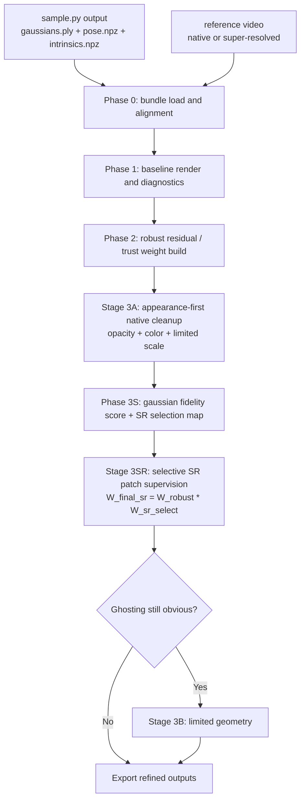
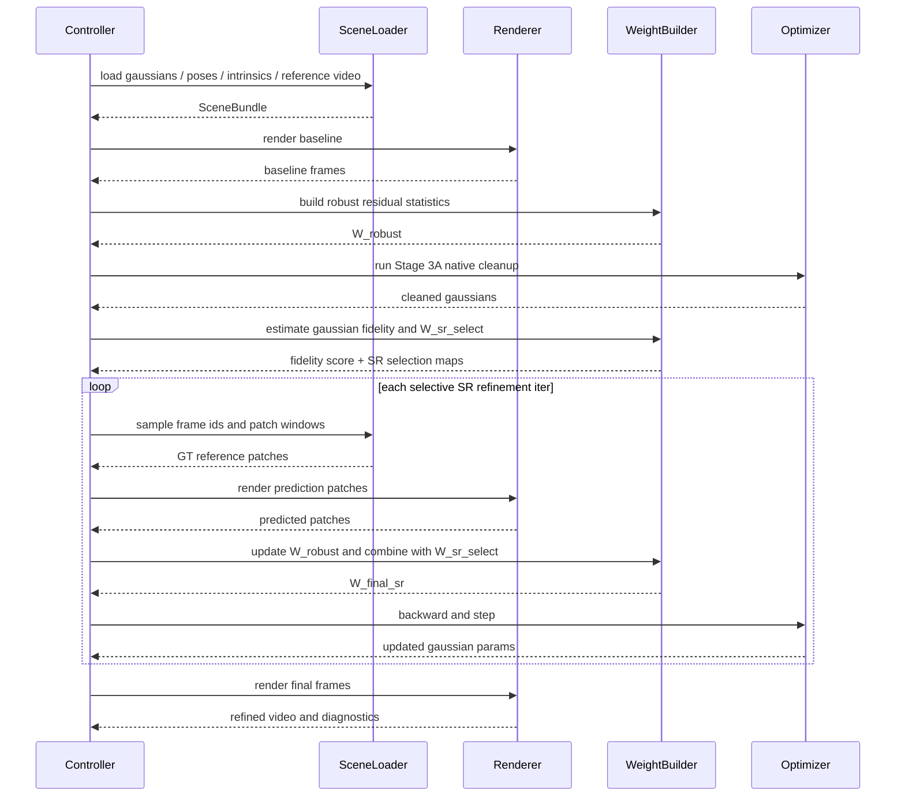

# Spec: Long-LRM 风格的 `sample.py` 后置高斯 refinement

## 定位

这份规格不是要替代 `specs/joint_refinement_camera_gaussians_v2.md`.

它的作用更具体:

- 把 `Long-LRM` 里最值得当前 Lyra 借用的那一段,单独落成一个可以直接进入实现的方案.
- 这段最核心的可借内容,就是:
  - feed-forward 先出一版高斯
  - 再做短迭代的 post-prediction optimization

因此,这份文档可以理解成:

- `joint_refinement_camera_gaussians_v2` 的一个更聚焦的子规格
- 专门回答:
  - 为什么 `sample.py` 主链不该直接吃超分视频
  - 为什么应该在 `sample.py` 之后增加一个独立的 post-refinement stage
  - 这个 stage 的输入输出、阶段拆分、损失设计、仓库落点应该怎么定

## 背景

当前 Lyra 的现实约束已经很明确:

1. `sample.py` 在有 `rgb_latents` 时优先直接使用 latent,不会优先重新编码 mp4.
2. provider 会把 RGB 与 intrinsics 一起裁剪缩放到当前 `img_size`.
3. demo / training 主档位仍以 `704x1280` 为当前工作分辨率.
4. 因此,“只把上游视频替换成超分版”并不会自然变成“更清晰的高斯输入”.

同时,当前最现实的问题也很明确:

1. 单轨迹结果仍会出现厚表面 / 双轮廓 / 半透明叠层.
2. 这些问题更像高斯和监督不一致的问题,而不完全是 pose 错误.
3. 当前 deferred renderer 保留高斯梯度,但会截断相机梯度.

这使得一个更自然的设计浮现出来:

- `sample.py` 继续只负责 feed-forward 初始化
- 额外增加一个 `post-refinement` 阶段
- 让这个阶段接收:
  - 初始高斯
  - 原始 pose / intrinsics
  - 原始或超分后的对等视频
- 然后只对高斯做短迭代优化

这条线与 `Long-LRM` 的后优化思路是同类问题.
但在 Lyra 里,它需要改成更适合当前症状的版本:

- 先 appearance-first
- 先 opacity / color / limited scale
- 再决定是否进入受限 geometry

## 目标

1. 在不改 `sample.py` 主推理范式的前提下,提升最终高斯渲染清晰度.
2. 让“超分后的对等视频”真正成为可利用的监督信号.
3. 优先解决厚表面、双轮廓、半透明叠层,而不是先做 pose 优化.
4. 让整个阶段具备:
   - 独立输入输出契约
   - 可断点续跑
   - 可诊断
   - 可阶段停止
5. 让超分后的对等视频以“选择性高频监督”的方式参与 refinement,而不是全图统一注入 SR 细节.
6. 在提高监督分辨率时,同时约束不受支持的高频细节,减少 aliasing-driven 伪细节.

## 不做的事

- 不改 diffusion 侧视频 / latent / pose / intrinsics 的生成逻辑.
- 不把超分视频直接回灌进 `sample.py` 主链伪装成更高分辨率输入.
- 不在 V1 中引入 pose optimization.
- 不在 V1 中重做 `tttLRM` / LaCT / fast-weight memory 主干.
- 不在 V1 中复刻传统 3DGS 的 densify-and-clone 全流程.

## 核心判断

### 为什么是“后置 refinement”,而不是“主链提分辨率”

因为当前主链受以下约束:

- latent 优先
- provider 固定 resize / crop
- renderer 输出尺寸由 `opt.img_size` 决定

所以“把视频超分后再喂主链”本质上不是一次小修.
它会变成:

- 分辨率 regime 变化
- latent 形状变化
- intrinsics 缩放逻辑变化
- checkpoint 泛化边界变化

这显然比“单独增加一个 post stage”更重.

### 为什么这个方案更接近 `Long-LRM`,而不是 `tttLRM`

因为这里的目标是:

- 在现有高斯输出后做一轮短迭代优化

而不是:

- 引入在线 fast-weight memory
- 引入 streaming autoregressive reconstruction
- 重做主干推理机制

所以当前阶段只吸收 `Long-LRM` 的:

- post-prediction optimization
- opacity / pruning 方法论

不吸收 `tttLRM` 的新主干.

### 为什么 SR 监督必须是选择性的

如果把超分后的对等视频直接作为全图统一监督,
会把多视图之间并不一致的生成细节一起灌进高斯.

这类错误监督最容易放大的问题是:

- 局部双轮廓
- 漂浮纹理
- 视角间不一致的假高频
- 原本已经可靠区域的过拟合锐化

因此,SR 监督不应只是“开或不开”的二值开关.
它更应该是一个空间选择问题:

- 哪些区域已经被原始视图充分监督,不该再强吃 SR
- 哪些区域在所有视图里都欠采样,才值得引入 SR 辅助

这一点优先吸收 `SplatSuRe` 的方法论:

- 先估计每个 Gaussian 的跨视图 fidelity
- 再构造每视图的 SR selection weight map
- 最后只在真正欠采样区域施加更强的 SR patch supervision

## 方案命名

建议内部把这条线称为:

- `LongLRM-style Post Refinement`

对应的最小入口建议为:

- `scripts/refine_post_sample.py`

或继续沿用现有 V2 命名体系:

- `scripts/refine_robust_v2.py`

如果沿用 V2 命名,则这份 spec 就是 V2 里的一个具体落地子路线.

## 数据契约

### 输入

#### 必需输入

- `gaussians_init_ply`
  - 来自 `sample.py` 的输出
  - 例如:
    - `outputs/.../gaussians_orig/gaussians_0.ply`
- `pose_path`
  - 例如:
    - `assets/demo/static/diffusion_output_generated_one/3/pose/xxx.npz`
- `intrinsics_path`
  - 例如:
    - `assets/demo/static/diffusion_output_generated_one/3/intrinsics/xxx.npz`
- `video_reference_path`
  - 原视频或超分后的对等视频

#### 配置输入

- `demo_config`
  - 用于复用当前 provider 的对齐逻辑
- `scene_index`
- `view_id`
- `frame_indices` 或 `target_subsample`

#### 可选输入

- `sr_scale_factor`
  - 例如 `2.0` / `4.0`
- `video_reference_mode`
  - `native`
  - `super_resolved`
- `patch_size`
  - 用于 patch-based supervision

### 对齐约束

如果 `video_reference_mode=super_resolved`,必须同时满足:

1. 时序完全一致
2. crop 完全一致
3. aspect ratio 完全一致
4. intrinsics 按同倍率缩放

如果这些条件不满足,这个阶段宁可直接报错,不要静默继续.

### 输出

- `gaussians_refined.ply`
- `render_refined.mp4`
- `metrics.json`
- `diagnostics.json`
- `config_effective.yaml`
- `residual_maps/*.png`
- `weight_maps/*.png`
- `sr_selection_maps/*.png`
- `gaussian_fidelity_histogram.json`
- `sr_selection_stats.json`
- `state/*.pt`

V1 不输出:

- `poses_refined.npz`

因为 V1 默认不做 pose optimization.

## 总体流程



## 时序图



## Phase 拆分

### Phase 0: SceneBundle 装配

这一阶段只做“对齐”.

目标:

- 把来自 `sample.py` 的高斯、相机、参考视频组装成一个统一的 `SceneBundle`
- 明确 native 分辨率和参考 supervision 分辨率
- 如果是 SR 视频,在这里就把 scaled intrinsics 构造好

建议产物:

- `scene_bundle.json`
  - 记录:
    - `native_hw`
    - `reference_hw`
    - `sr_scale_factor`
    - `num_frames`
    - `view_id`

#### 失败即停止的条件

- pose 帧数和视频帧数不一致
- intrinsics 帧数和视频帧数不一致
- SR 视频尺寸不是原视频整数倍率
- crop / aspect ratio 不匹配

### Phase 1: baseline render and diagnostics

目标:

- 用初始高斯重渲染当前目标帧
- 先测清楚问题到底有多重

至少输出:

- baseline PSNR
- baseline LPIPS 或 patch perceptual 指标
- sharpness
- opacity_lowconf_ratio
- scale_tail_ratio

如果 baseline 都无法稳定重现,就不应进入优化阶段.

### Phase 2: robust residual / trust weight build

这一阶段直接吸收 `joint_refinement_camera_gaussians_v2` 的核心思想:

- 不是所有像素都应该被同等强度拟合
- 残差大的地方先降权
- 降权不等于完全删除
- 这一步构造的是“监督可信度”,不是“是否使用 SR”的几何选择

这一阶段的核心产物建议明确命名为:

- `W_robust`
  - 表示当前像素区域的监督可信度
  - 后续 native loss 和 SR loss 都可以复用它

#### V1 最小版

- RGB residual
- quantile normalize
- soft trust weight
- EMA
- optional blur

#### 这一阶段暂时不做的事

- 不直接决定哪里该使用 SR
- 不根据几何采样情况挑 SR 区域
- 不把 `W_robust` 误当成最终 SR 权重

#### 如果使用 SR 视频

建议:

- weight map 在 SR patch 上构造
- 但 early stage 可以先在低分辨率 patch 上估计
- 后期再切到更细 patch

### Stage 3A: appearance-first

这是第一阶段真正会更新参数的部分.

只更新:

- opacity
- color
- limited scale

先冻结:

- means
- rotation

原因:

- 当前主要问题更像雾感、叠层和双轮廓
- 先放开几何容易把错的细节硬写进三维结构

#### 目标

- 压掉半透明叠层
- 提高清晰边缘
- 降低雾感

#### 推荐 loss

- `L_rgb_weighted`
- `L_perceptual_patch`
- `L_opacity_sparse`
- `L_scale_ceiling`

### Phase 3S: Gaussian fidelity score 与 SR selection map

这一步是把 `SplatSuRe` 最值得借用的部分并进当前路线.

目标:

- 不再把 SR 监督当作全图统一增强
- 先估计每个 Gaussian 是否已经在原始视图中被充分采样
- 再为每个视图构造“哪些区域该吃 SR”的选择图

建议引入两个对象:

- `gaussian_fidelity_score`
  - 每个 Gaussian 一个 `[0, 1]` 分数
  - 分数越高,表示它已经在某些原始视图里得到较高保真监督
  - 分数越低,表示它在所有视图里都长期欠采样,更值得引入 SR 辅助

- `W_sr_select`
  - 每个视图一张 `[H, W]` 的 SR selection weight map
  - 值越高,表示该区域允许 SR 监督更强地参与
  - 值越低,表示该区域更应依赖 native supervision,避免把 SR 假细节写进结构

这一阶段的核心不是优化高斯,
而是决定“SR 到底应该影响哪里”.

建议产物:

- `gaussian_fidelity_histogram.json`
- `sr_selection_maps/*.png`
- `sr_selection_stats.json`

#### 设计原则

- 先完成 Stage 3A 的 native cleanup,再估计 fidelity
- 不在高斯仍然很脏的时候直接信任 SR 区域选择
- `W_sr_select` 不是 `W_robust` 的替代,两者语义不同

### Stage 3SR: selective SR patch supervision

这是 SR 视频真正参与优化的阶段.

和“只要启用 SR 就全图上 SR loss”的直觉不同,
这一阶段强调的是:

- 只在欠采样区域使用更强的 SR 监督
- 已经被 native 视图充分支持的区域,继续以 native supervision 为主
- SR 不负责“全面改写细节”,只负责“补原本缺失的细节”

建议最终 SR 权重写死为:

- `W_final_sr = W_robust * W_sr_select`

其中:

- `W_robust`
  - 表示当前区域监督是否可靠
- `W_sr_select`
  - 表示当前区域几何上是否值得引入 SR

这样做的目的很明确:

- 如果某区域残差异常大,但又不像可靠 SR 区域,就不应强吃 SR
- 如果某区域几何上欠采样,但当前监督也不稳定,也不应无脑放大 SR

#### 目标

- 只在真正欠采样区域注入高频监督
- 降低 SR 细节跨视图不一致造成的结构污染
- 提升边缘与纹理清晰度,同时保持 multi-view consistency

#### 推荐 loss

- `L_rgb_weighted_native`
- `L_rgb_weighted_sr`
- `L_perceptual_patch_sr`
- `L_opacity_sparse`
- `L_scale_ceiling`
- `L_sampling_smooth`

#### 默认策略

- early: 以 native cleanup 为主,SR loss 权重保守
- middle: selective SR patch supervision 成为主力增强项
- late: patch 变小,用于细节锐化,但仍保持选择性权重

### Stage 3B: limited geometry

只有在下面条件都满足时才进入:

1. Stage 3A 已明显降低雾感与半透明叠层
2. Stage 3SR 已经运行过,且 selective SR 并未继续显著改善残余问题
3. diagnostics 显示更像局部结构重叠,而不是大范围 pose 错位
4. 问题更像几何局部错位,而不是 SR 假细节污染

这一阶段允许小幅更新:

- scale
- rotation
- means

但 `means` 必须受限:

- 加 `means_delta_cap`
- 加 `L_means_anchor`
- 优先沿原射线方向做受限位移

V1 仍然不引入 pose.

## Loss 设计

### 核心 loss

- `L_rgb_weighted_native`
  - `W_robust * Charbonnier(pred_native - gt_native)`
  - 负责稳定的原始监督拟合
- `L_rgb_weighted_sr`
  - `W_final_sr * Charbonnier(pred_sr_patch - gt_sr_patch)`
  - 其中:
    - `W_final_sr = W_robust * W_sr_select`
  - 负责选择性高频监督
- `L_perceptual_patch_sr`
  - patch 级 LPIPS 或替代感知损失
  - 只在 selective SR patch supervision 阶段启用
  - 不建议在全图统一启用
- `L_opacity_sparse`
  - 控制半透明叠层
- `L_scale_ceiling`
  - 惩罚过大的 Gaussian 尺度尾部
  - 目标是减少厚表面、叠层和雾感
  - 这条约束继续保留当前 `scale_reg` 的主要职责
- `L_sampling_smooth`
  - 吸收 `Mip-Splatting` 的 3D smoothing 思想
  - 根据训练视图所支持的最大采样频率,抑制不受支持的高频小 Gaussian
  - 目标是在启用更高分辨率 patch supervision 时,避免 aliasing-driven 伪细节
  - 这条约束不是 `L_scale_ceiling` 的替代,而是第二条互补约束

### Stage 3B 附加 loss

- `L_means_anchor`
  - 防止位置漂移过远
- `L_rotation_reg`
  - 防止朝向无约束乱转

### V1 不启用

- pose loss
- temporal pose smoothness
- joint pose + gaussian optimization
- `Mip-Splatting` 的 2D Mip filter
  - 这部分更偏 renderer-level 改造
  - 不进入当前 V1 主线

## 分辨率策略

### 原则

既然这份 spec 的目标之一就是让 SR 视频真正参与监督,
那就不能简单把所有东西再缩回 native `img_size`.

但 SR 监督也不应是“整帧高分辨率 + 全图统一注入”.
更合理的默认策略是:

- native supervision 先做稳定 cleanup
- SR supervision 后做 selective enhancement
- patch-based 是默认路径
- selective SR 是默认原则

### 推荐策略

#### Step 1

- baseline 阶段仍可先跑 native 全帧

#### Step 2

- Stage 3A 以 native supervision 为主
- 先清理 opacity / color / scale,不要一开始就全力吃 SR

#### Step 3

- 构造 `gaussian_fidelity_score` 与 `W_sr_select`
- 明确 SR 应该介入哪些区域

#### Step 4

- Stage 3SR 切到 selective SR patch supervision
- patch 从粗到细:
  - early: 大 patch,低频稳定
  - middle: 中 patch,开始局部增强
  - late: 小 patch,细节锐化

### 为什么 selective patch-based 是默认

因为:

- 现有渲染器输出尺寸跟 `opt.img_size` 强绑定
- 高分辨率整帧监督显存压力太大
- patch-based 更容易做 coarse-to-fine
- selective SR 可以显著降低 SR 假细节污染 well-supported 区域的风险

## 仓库落点

### 直接复用

- `sample.py`
  - 作为初始高斯生成器
- `src/rendering/gs_deferred.py`
  - 作为主要可导 renderer
- `src/rendering/gs_deferred_patch.py`
  - 作为 patch supervision 的优先入口
- `src/models/data/provider.py`
  - 复用基础数据对齐逻辑

### 建议新增或继续沿用的模块

- `scripts/refine_robust_v2.py`
  - 作为唯一入口
- `src/refinement_v2/config.py`
- `src/refinement_v2/data_loader.py`
- `src/refinement_v2/runner.py`
- `src/refinement_v2/stage_controller.py`
- `src/refinement_v2/weight_builder.py`
- `src/refinement_v2/gaussian_adapter.py`
- `src/refinement_v2/losses.py`
- `src/refinement_v2/diagnostics.py`
- `src/refinement_v2/state_io.py`

### 模块职责映射

#### `data_loader.py`

负责:

- 读高斯
- 读 pose / intrinsics
- 读原视频或 SR 视频
- 构造 scaled intrinsics
- 装配 `SceneBundle`

#### `gaussian_adapter.py`

负责:

- 把 `.ply` 转成可训练参数
- 按 stage 冻结 / 解冻
- 施加 `means_delta_cap`
- 为每个 Gaussian 维护或导出 `gaussian_fidelity_score`
- 为后续 selective SR 提供 per-Gaussian 几何统计入口

#### `weight_builder.py`

负责:

- residual 统计
- `W_robust` 构造
- `W_sr_select` 构造
- `W_final_sr = W_robust * W_sr_select` 的组合
- EMA / blur / quantile normalize

#### `runner.py`

负责:

- baseline
- Stage 3A native cleanup
- fidelity score 与 SR selection map 的构造调度
- selective SR patch supervision
- 可选 Stage 3B
- patch 采样
- 优化步进

#### `diagnostics.py`

负责:

- baseline / residual / weight maps 输出
- `gaussian_fidelity_histogram`
- `sr_selection_maps`
- `sr_coverage_ratio`
- `native_vs_sr_loss_ratio`
- pruning 与最终导出摘要

## CLI 草案

```bash
python3 scripts/refine_robust_v2.py \
  --config configs/demo/lyra_static.yaml \
  --gaussians outputs/.../gaussians_orig/gaussians_0.ply \
  --pose path/to/pose.npz \
  --intrinsics path/to/intrinsics.npz \
  --reference-video path/to/reference.mp4 \
  --reference-mode super_resolved \
  --sr-scale 2.0 \
  --scene-index 0 \
  --view-id 3 \
  --outdir outputs/refine_v2/view3_sr2
```

### 第一版建议只暴露这些参数

- `--config`
- `--gaussians`
- `--pose`
- `--intrinsics`
- `--reference-video`
- `--reference-mode`
- `--sr-scale`
- `--scene-index`
- `--view-id`
- `--outdir`
- `--dry-run`
- `--resume`

## 输出目录布局

```text
outdir/
  config_effective.yaml
  scene_bundle.json
  diagnostics.json
  metrics.json
  gaussians_refined.ply
  videos/
    render_baseline.mp4
    render_refined.mp4
  residual_maps/
  weight_maps/
  state/
```

## 默认通过线

第一版不追求“绝对最优”.
先追求“方向正确且可重复”.

建议默认通过线:

1. Stage 3A 后:
   - sharpness 提升
   - `opacity_lowconf_ratio` 下降
   - 主体边缘更清楚
2. Stage 3B 后:
   - 不允许明显新增漂点或结构塌陷
3. 和 baseline 比较:
   - 至少有一种可量化收益
   - 同时人眼主观上双轮廓减轻

## 风险清单

### 风险1: SR 视频并不真正“对等”

表现:

- 看起来更清晰
- 但细节发生 hallucination 或帧间抖动

后果:

- 高斯会学到错误的高频细节

应对:

- 第一版优先使用保守 SR
- 强制逐帧对齐检查
- 高残差区域降权,不要强拟合

### 风险2: 直接放开 geometry 导致结构被写坏

应对:

- V1 只默认开启 Stage 3A
- Stage 3B 必须显式启用

### 风险3: patch-based render 路径与全帧 render 路径不一致

应对:

- baseline 阶段保留一份全帧对照
- patch 路径和全帧路径共用同一套高斯参数解释

### 风险4: 继续把问题误诊为 pose

应对:

- 这份 spec 明确不在 V1 里引入 pose optimization
- 先把高斯与监督不一致问题处理干净

### 风险5: fidelity / selection map 估计错误

表现:

- 本应依赖 native supervision 的区域被错误地放大 SR
- 本应补高频的欠采样区域又被过度抑制

后果:

- selective SR 退化成“到处都用 SR”或“哪里都不敢用 SR”

应对:

- 先完成 Stage 3A native cleanup,再估计 fidelity
- 输出 `gaussian_fidelity_histogram` 与 `sr_selection_maps`
- 同时观察 `native_vs_sr_loss_ratio`,避免 SR 支路失控

## Deferred ideas

### EDGS-style local reinitialization

`EDGS` 当前不进入 V1 implementation plan.

原因:

- 它更像“初始化增强模块”
- 当前主线更需要的是“后置 refinement + selective SR”
- 现在直接引入 EDGS,会把主线从“后置优化”拉回“重做初始化”

但它值得保留为一个未来的局部 fallback 方向:

触发条件建议为:

1. Stage 3A + Stage 3SR 后,仍有明显结构缺失
2. diagnostics 说明问题更像初始化覆盖不足,而不是监督噪声
3. 对应区域有足够可靠的 pose / intrinsics / frame overlap

候选动作:

- 对局部区域做 dense correspondences
- triangulate 一批新的高置信 Gaussian
- 作为 local re-seed 使用,而不是全局重建

### Mip-style 2D filter

`Mip-Splatting` 的 2D Mip filter 当前也不进入 V1 主线.

原因:

- 它更偏 renderer-level 改造
- 当前更适合先吸收其 3D smoothing 思想
- 等 selective SR 路线稳定后,再决定是否需要进一步改造 rasterization 行为

## 与现有 V2 的关系

这份 spec 不是新方向.
它是对 V2 的收束和具体化:

- V2 负责给出大原则:
  - robust weighting
  - gaussian-only 优先
  - pose 后置
- 这份文档负责把其中最值得先落地的一条方案写死:
  - `sample.py` 后置
  - `Long-LRM` 风格后优化
  - SR 对等视频可选接入

## 推荐实现顺序

1. `dry-run`
   - 先打通 SceneBundle 与 baseline
2. Stage 3A native supervision
   - 不带 SR
   - 先做 appearance-first cleanup
3. Phase 3S: fidelity score + SR selection
   - 先决定哪里该吃 SR
4. Stage 3SR: selective SR patch supervision
   - 带 scaled intrinsics
   - 带 `W_final_sr`
5. 加入 `L_sampling_smooth`
   - 吸收 `Mip-Splatting` 的 3D smoothing 思想
   - 不替换 `L_scale_ceiling`
6. Stage 3B limited geometry
   - 只作为后续保守阶段
7. 再决定是否需要研究:
   - renderer-level `Mip` filter
   - `EDGS-style` local reinitialization

## 一句话总结

当前 Lyra 最值得先落地的,不是“把 SR 视频全图硬喂给后置 refinement”,也不是“现在就重做初始化”.

而是:

- 让 `sample.py` 继续做初始化
- 让 `Long-LRM` 风格的短迭代后优化先把高斯变干净
- 让 `SplatSuRe` 风格 selective SR 只在欠采样区域提供高频监督
- 让 `Mip-Splatting` 的 3D smoothing 思想负责约束不受支持的高频细节
- 把 `EDGS` 保留成未来可能的局部 reinit 方案,而不是当前主线
